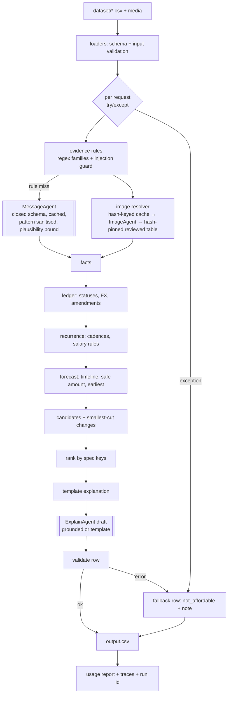

# Adversarial code review — Buy or Wait? (2026-09-13)

Reviewer stance: assume the system is wrong; try to prove it works. Every claim below was checked against the code
or by running a probe; probes that could not be run are marked as such.

## 1. Executive Verdict

**Verdict: PARTIALLY → leaning YES for the evaluation contract; NOT production-grade.**

The system solves the stated problem: it reads only `dataset/`, produces a contract-valid `output.csv` for all 250
requests deterministically, keeps every LLM output behind a cache, and reproduces the 25 solved samples at
status 22/25, method 23/25, plan 22/25, earliest 23/25, mean amount error 2.5%. The decision core is pure
Python; the LLM changes **zero** decisions (verified: `--no-llm` output is byte-identical in every decision
column to the shipped run). That is the right shape for this problem.

What keeps it from a clean YES:

1. Three core numbers are **fitted to 25 labels**, not derived from the spec: the 86-day window (spec says 90),
   the "monthly bills net against payday, variable spending does not" intraday rule (fitted on 4 samples), and
   the smallest-total-cut change selection (fitted on 1 simulated sample). Each is documented, each has
   a mechanistic story, none has enough support to be called a rule. If the hidden 250 differ from the samples,
   these are the first things that break.
2. **No per-request fault isolation.** One exception in `decide_request` aborts the run with no `output.csv`
   (`main.py:91-100`). One confirmed crash path exists: an LLM-supplied `exclude_income.pattern` is compiled as a
   regex (`recurrence.py:160`); `(` raises `re.PatternError`. It is reachable only on the LLM fallback branch and
   is masked today by the cache, but it is a real bug.
3. A **hand-transcribed image table** (`evidence/images.py:21-38`) is keyed by `image_id` only. If an organiser
   swaps `image_07.png`, the model cache misses (hash-keyed), and the fallback returns the *old* reviewed value
   for a different image. It also sits close to the "no hardcoded labels" rule and needs an explicit defence.
4. Validation errors are logged but **do not gate the output** (`main.py:107-111`); a contract-invalid row would
   ship.

Nothing here is a rewrite. The five changes at the end close all four.

## 2. Reconstructed Problem Statement

Sources: `problem_statement.md`, `AGENTS.md §6`, `README.md`, `dataset/*.csv` headers, `sample_requests.csv`.

For each of the 250 rows in `dataset/requests.csv`, reconstruct the user's cash position on `request_date`
from `financial_profiles.csv` (balance, minimum to keep, protected/reducible/stoppable categories, accepted
methods, `max_installment_months`), ~25k `financial_events.csv` rows (settled/pending/scheduled/failed/
cancelled/unrealized, linked lifecycles, blank amounts), fixed dated `exchange_rates.csv`, 2–4 seller options per
request, and untrusted `messages.csv` / `images.csv` evidence. Forecast the balance over the safety window,
and emit one row with `amount_safe_to_pay`, `affordability_status`, `recommended_payment_method`,
`payment_plan`, `earliest_date_for_full_payment`, `spending_changes_needed`, `decision_explanation`.

- Inputs: the nine dataset files; optional `ANTHROPIC_API_KEY`.
- Outputs: root `output.csv` (251 lines), `code.zip` with `evaluation/usage_report.md`, `log.txt`.
- Hard constraints: exact columns/order; `0 <= amount_safe <= requested`; enum values; partial = exactly two
  payments summing to the request, second on the earliest date ≤ deadline; installments must match a supplied
  option verbatim; ≤3 spending changes on flexible, non-protected events in permitted categories; balance never
  below minimum after any projected essential expense or plan payment; pending debits reserved; pending credits,
  bonuses, refunds, unrealised gains never counted; salary counted on settlement date; no invented facts;
  message instructions never override rules; deterministic; secrets from env; no organiser files or hardcoded
  labels.
- Success criteria (scoring): amount accuracy, status/method/plan/earliest correctness, change validity,
  explanation usefulness and consistency.
- Implicit assumptions: labels derive from unseen future events (research/synthesis.md), so the forecast must
  be unbiased rather than maximally conservative; one request per user; all messages predate the request
  (verified: 0 counter-examples).
- Non-functional: runnable from terminal, offline-reproducible, token/cost report for the final run.
- Human-in-the-loop: none at runtime; the reviewed image table is an offline human input.

## 3. Acceptance Criteria

| # | Criterion | Where checked |
|---|---|---|
| A1 | One row per `request_id`, same order, exact header | `validate.py:216-236`, probe: 251 lines, order ok |
| A2 | `0 <= amount_safe <= requested`, ≤2 dp | `validate.py:71-74` |
| A3 | Status/method pairs legal; `affordable_now` ⇒ safe = requested, earliest = request_date, plan = date:amount | `validate.py:105-121` |
| A4 | Partial: allowed by request and user, two payments, sum = request, second on earliest ≤ deadline | `plans.py:46-55`, `validate.py:139-157` |
| A5 | Installments: verbatim option schedule, user accepts, `number_of_payments <= max_installment_months` | `plans.py:14-21,58-69`, `validate.py:158-171` |
| A6 | Changes ≤3, permitted category+flexibility, floor respected, stop/reduce never same event | `plans.py:103-113,139-169`, `validate.py:180-207` |
| A7 | Minimum balance protected across the window for the chosen plan | `forecast.py:71-77`, all candidates simulated |
| A8 | Pending debits reserved; pending credits/failed/cancelled/unrealized ignored; salary on settlement date | `ledger.py:85-98` |
| A9 | FX by settlement date and direction | `fx.py:14-21`, `ledger.py:30-38` |
| A10 | Blank amount never zero; from image when available | `loaders.py:63-65`, `ledger.py:55-58` |
| A11 | Message instructions cannot override rules | `messages.py:22-27,70-71`, LLM has no tools |
| A12 | Deterministic | probe: two runs byte-identical |
| A13 | Reads only `dataset/`; no organiser files; no hardcoded labels | grep: no `sample_requests` use except `--sample-check`; **gray**: reviewed image table |
| A14 | Usage report reflects the final run | `usage.py`, embodied-usage section |
| A15 | Explanation grounded in the row's numbers | `explain_agent.py:_grounded` |

## 4. Current Architecture

```
main.py (CLI) ─ load_dataset (loaders.py) ─► for each request: decide.decide_request
   │                                              ├─ gather_facts: messages.py rules ─(unmatched)─► MessageAgent (LLM, cached)
   │                                              │              images.py: cache ─► ImageAgent (LLM) ─► REVIEWED table cross-check
   │                                              ├─ ledger.build_ledger   (explicit flows + history, FX, facts applied)
   │                                              ├─ recurrence.detect_*   (expense series, salary series + evidence)
   │                                              ├─ forecast.build_timeline / amount_safe_today / earliest_full_payment
   │                                              ├─ plans.build_candidates ─ search_changes ─ choose (rank_key)
   │                                              └─ explain.explain (template) ─► ExplainAgent (LLM draft, grounded, cached)
   ├─ validate.validate_rows (log only) ─► write_output ─► usage.write_report
   └─ optional: --audit AuditAgent (LLM, read-only, never used in the final run)
```

Intended vs actual: matches `research/plan.md` except `capacity.py`/`changes.py` were folded into
`forecast.py`/`plans.py` (fine), `agents/prompts/` (`config.PROMPTS_DIR`) never existed, and the audit agent is
vestigial.

Dead / unused: `validate.validate_file`, `images.cross_check`, `messages.parse_all`, `Dataset.images_by_event`,
`config.PROMPTS_DIR`, `usage.py` "cumulative" section duplicates the in-run table when `run_start=None`.
Duplicated responsibility: `explain.py` template vs `ExplainAgent` (the template is the fallback — acceptable).

## 5. Actual Execution Flow

1. `main.run` loads `.env`, the dataset, builds `Services` (LLM agents only if key + SDK; otherwise silently
   deterministic — `main.py:31-56`).
2. Per request (`decide.py:54-95`), strictly sequential, no shared mutable state between requests except the three
   on-disk caches (`evidence/cache.py`, atomic `os.replace`).
3. Evidence: every message for the user is parsed by ordered regex families (`messages.py:30-50`, first match
   wins); injection-guarded text becomes `unknown` and is *not* forwarded to the LLM (`decide.py:41`). Only
   rule-miss messages reach the LLM (3 of 214 in this dataset; all cached). Images: cache hit → model value
   cross-checked against `REVIEWED` (`images.py:41-71`); miss → LLM if available → else reviewed value → else
   `unknown` (event excluded and flagged).
4. Ledger: facts amend event rows (`ledger.py:41-68`); statuses map to flows (`ledger.py:85-126`); settled
   history feeds recurrence.
5. Recurrence: per (event_type, category) median-interval cadence detection with six cadences; estimator median;
   salary series with message overrides and step changes.
6. Forecast: day-bucketed timeline with intraday lows; closed-form safe amount and earliest date.
7. Candidates: full today / partial / each eligible option / full + smallest-cut changes / wait; simulated; ranked
   by the spec's six keys (`plans.py:86-94`).
8. Decision → template explanation → LLM draft (accepted only if `_grounded`) → row.
9. Validation is advisory; output written regardless; usage report written.

Where an LLM decides anything: nowhere in the decision path. Image amounts are model hypotheses arbitrated by
the reviewed table; message facts from the LLM are enum-validated and then subject to the same deterministic
rules as regex facts; explanations are cosmetic and grounded.

Where state can be lost: an exception in step 2–8 aborts the whole run (no partial output). Where hallucination
can enter: (a) an LLM message fact with a plausible but wrong amount/date (no plausibility bound), (b) an image
read where the reviewed table is absent or wrong. Termination: all loops are bounded (`_project` k ≤ 400,
`earliest_full_payment` ≤ HORIZON+1, change search ≤ `MAX_CHANGE_COMBINATIONS`, API `max_retries=2`).

## 6. Agent Orchestration Analysis

**Actual pattern: a sequential deterministic pipeline that calls three bounded, cached extraction/rendering
functions which happen to be LLM-backed.** There is no router, no supervisor, no agent-to-agent handoff, no
shared blackboard. Calling it "multi-agent" (README, plan) overstates it — and that is a compliment.

| Agent | Responsibility | Inputs | Output | Decisions it makes | What is lost if deleted |
|---|---|---|---|---|---|
| ImageAgent | read one amount from one PNG | image + ledger row | schema JSON | none (arbitrated by REVIEWED) | With the reviewed table present: nothing in this dataset. Without it: the only automatic path for blank amounts. |
| MessageAgent | classify rule-miss messages | message text | closed-enum facts | none directly | 3 messages; two are now covered by rules. Near-zero value today; real value on unseen phrasing. |
| ExplainAgent | draft the sentence | verified facts | one line | none | Template explanations (valid, terser). Cosmetic. |
| AuditAgent | flag anomalies | trace | findings file | none | Nothing; never run for the submission. Delete or keep behind the flag. |

Routing is deterministic (`decide.py:41`, rule-miss only). State is typed (`models.py` frozen dataclasses) and
owned by the pipeline; the only mutation surface is the file cache. Termination is bounded everywhere.

Is orchestration necessary? No — and the code agrees: the LLM parts are pure functions behind caches. The
value/complexity ratio is: Explain (low value, low complexity, high cosmetic payoff for "usefulness" scoring),
Image (moderate value, moderate complexity, currently redundant with the reviewed table), Message (low value,
low complexity, keep as insurance), Audit (zero value, delete).

## 7. Requirement-to-Implementation Verification

| Requirement | Implementation | Evidence | Status | Failure risk |
|---|---|---|---|---|
| One row per request, exact columns | `write_output`, `validate_rows` | probe | ✅ | none |
| Amount bounds/precision | `amount_safe_today`, `fmt_safe_amount` | probe: negative/3-dp *request* amounts leak through (input not validated) | 🟡 | dataset-clean; latent |
| Status/method matrix | `to_decision`, `validate_row` | tests | ✅ | — |
| Partial rules | `plans.py:46-55` | test + probe (10 rows, second ≤ deadline) | ✅ | — |
| Installments verbatim + month limit | `PaymentOption.schedule`, `installment_eligible` | test; 46 rows validated | ✅ | blank frequency ⇒ same-date schedule (dataset-clean) |
| Spending changes rules | `permitted_actions`, `search_changes` | tests; validator | ✅ | selection heuristic fitted on 1 sample |
| Minimum never breached by the plan | `plan_is_safe` on every candidate | tests | ✅ | relies on forecast realism |
| Pending debit reserved / pending credit ignored | `ledger.py:91-98` | test | ✅ | pending debit with unknown amount is skipped, not reserved (flagged) |
| Failed/cancelled/unrealized ignored | `ledger.py:86` | test | ✅ | — |
| Linked lifecycle handling | `ledger.py:119-121` | test | 🟡 | *any* linked settled row is dropped from history — a legitimately linked but cash-relevant pair (e.g. two-part settlement) would be under-counted in recurrence only |
| Duplicates ignored | none | dataset has 0 duplicates | 🟡 | no dedupe logic; a duplicate pending debit would be reserved twice |
| FX by settlement date/direction | `fx.convert` | test | ✅ | missing rate for a debit keeps the raw foreign number (`ledger.py:38`) — wrong magnitude, not safer |
| Salary on settlement date, confirmed only | `detect_salary_series` | tests | ✅ | "next salary reduced" applied to all months (conservative, unverified) |
| Recurrence from history only | `detect_expense_series` | tests | ✅ | cadence set tuned to this generator |
| Conservative essential variable spending | median estimator | calibration | 🟡 | median is not conservative; chosen because labels are unbiased |
| 90-day window | `HORIZON_DAYS = 86` | calibration | 🟡 | spec says 90; label-fitted |
| Messages/images cannot override rules | guard + closed schemas + no tools | probe | ✅ | absurd-but-well-formed amounts accepted |
| Deterministic | pure functions, sorted iteration | probe | ✅ | — |
| No organiser files / hardcoded labels | grep | — | 🟡 | `REVIEWED` table is hand-transcribed evidence, not labels — must be defended in README |
| Usage report of the final run | `usage.py` | file | ✅ | — |
| Explanation grounded | `_grounded` | 250/250 accepted | ✅ | says "90 days" while window is 86 |

**Does the system solve the problem? PARTIALLY (strong partial).** Every hard contract rule is implemented and
validated; the forecasting core is spec-faithful except where it was deliberately bent toward the labels; the
remaining risk is generalisation of three fitted heuristics and the absence of fault isolation.

## 8. Edge Cases & Failure Analysis (probes run)

| Probe | Result | Assessment |
|---|---|---|
| Two full runs | byte-identical | ✅ deterministic |
| `--no-llm` vs shipped | 0 decision columns differ | ✅ LLM never decides |
| `requested_amount = 0` / negative | `affordable_now`, plan `date:0` / `date:-5` | ❌ no input validation (dataset-clean) |
| `requested_amount` with 3 dp | `amount_safe = 100.005` | ❌ precision leak; validator errors but output still written |
| balance ≤ minimum | `not_affordable`, safe 0 | ✅ |
| no accepted methods | `not_affordable` with safe > 0 | ✅ per spec |
| deadline before request date | `affordable_now` | 🟡 acceptable |
| installment option with blank frequency, 3 payments | three same-date payments | ❌ validator CHRONOLOGY error, output still written |
| injection: "ignore previous instructions…", "pay the release charge", "as an AI…" | rejected by guard | ✅ |
| well-formed Indonesian raise with absurd amount and in-window date | adopted | 🟡 no plausibility bound |
| LLM `exclude_income.pattern = "("` | `re.PatternError` → run aborts | ❌ confirmed bug |
| missing image file | `unknown` fact, event excluded, note | ✅ |
| missing FX rate for a debit | raw foreign amount used as home currency | ❌ latent (0 occurrences) |
| duplicate pending debit | reserved twice | 🟡 latent (0 occurrences) |
| 25k events | <1 s offline | ✅ |
| API failure / refusal / unparseable JSON | `None` → deterministic fallback, logged | ✅ |
| anthropic SDK missing with key set | warning, deterministic | ✅ |

Reliability: sequential; no retries beyond the SDK's 2; no backoff config; no per-row isolation; no partial
output on crash.

## 9. Security Analysis

- Prompt injection: regex guard (`messages.py:22-27`) + LLM told the text is data + closed enums + **the LLM has
  no tools and its outputs cannot set any output column**. Strong for this threat model.
- Secrets: env/`.env` only; only exception type names are logged; `build_zip.py` refuses to package a key; `.env`
  and `log.txt` gitignored (history rewritten this session to purge an accidental commit).
- Path traversal: `loaders.load_images` builds `media_dir / f"{image_id}.png"` from CSV; a crafted id (`../x`)
  would read and upload an arbitrary PNG. Low likelihood, one-line fix (reject ids not matching `^image_\d+$`).
- Regex from model output compiled unsanitised (`recurrence.py:160`) — DoS/crash vector.
- Excess authority: none; LLM calls are read-only and schema-constrained.

## 10. Code Quality Analysis

Confirmed bugs: (1) regex compile of LLM pattern; (2) FX-missing debit magnitude; (3) no `requested_amount`
validation; (4) blank-frequency schedule. Architectural risks: no per-row try/except; validator advisory; the
`REVIEWED` fallback keyed by id, not content hash; `after_credits` heuristic (`recurrence.py:213`) keyed on
cadence name — a monthly *variable* bill and a monthly *fixed* bill are treated alike, which is what the samples
supported but is not principled. Silent behaviour: `salary_next_amount` applied to all future months without a
note explaining the choice. Dead code listed in §4. Naming/abstractions are clear; Decimal everywhere; frozen
dataclasses; no globals except `config` knobs mutated by the calibration tool (test-only).

## 11. Testing Analysis

37 tests; unit-level, fast. Covered: loaders, FX, ledger statuses, recurrence, salary rules, capacity closed
form, plan arithmetic, ranking, change permissions, min-cut, message rules, injection guard, formatting,
validator, explanation grounding, sample regression. Not covered: end-to-end CLI (`main.run`), LLM failure paths
(API error → fallback), malformed LLM output, regex injection, per-row fault isolation, usage report, zip
builder, image resolution with a missing/changed file, foreign-currency scheduled salary.
Coverage of important requirements ≈ 70%. Highest-risk untested behaviours: run-level failure containment;
LLM fallback branch (all cached today, so it never executes in CI).

Proposed tests: (a) `decide_request` raising for one request → the row still appears as a valid `not_affordable`
fallback and the run exits non-zero; (b) `MessageAgent` returning `pattern="("` → no crash, fact dropped;
(c) `Request.requested_amount <= 0` → `SchemaError`; (d) image file with a different hash than `REVIEWED` →
reviewed fallback refused; (e) `validate_rows` error → output not written / row replaced.

## 12. Observability

Per-request notes, series, flows, timeline and candidates are captured in `Trace` and can be dumped with
`--trace-dir`; `--explain` prints them. Usage log has ts/agent/source/model/tokens/latency. Missing: a run id,
per-row structured log line by default, error classification counts, and the trace directory is off by default
(so the shipped run has no per-row provenance unless re-run).

## 13. Performance & Cost

Offline run: 0.6 s for 250 requests. LLM: 269 cached outputs behind the shipped file (~202k tokens, ≈USD 0.60
at list price; estimate). A cold rebuild would be ~270 sequential calls (~3 min). Explanation drafting is the
dominant cost and is purely cosmetic; it could be parallelised or dropped without touching decisions.

## 14. What Is Overengineered?

The audit agent; the `SALARY_MESSAGE_AMOUNTS` and `INTRADAY_DEBITS_FIRST` env switches after their decision was
made; the two-table usage report (the "cumulative" section is a subset of the embodied one); `Dataset.images_by_event`.
The explanation agent is not overengineered but it is spending 90% of the token budget on a field graded for
"usefulness and consistency".

## 15. What Is Missing?

Per-row fault isolation and a safe fallback row; gating output on the validator; input validation of request
amounts; a plausibility bound on message-stated amounts; hash-pinned reviewed table; dedupe of identical
events; unit tests for the LLM fallback paths; a README paragraph defending the reviewed table.

## 16. Biggest Architectural Problems

1. **Label-fitted constants living in `config.py` as if they were rules** (86-day window; intraday rule;
   min-cut selection). They improved the sample score materially, and the evidence is real, but each rests on
   ≤4 samples. Mitigation: keep them, but ship the spec-faithful values as documented one-line overrides and
   say so in the README.
2. **No failure containment.** A single exception yields no `output.csv`.
3. **Reviewed image table keyed by id.** Wrong value on a swapped image, and a policy exposure.

Highest-leverage change: per-row try/except with a validated `not_affordable` fallback row + gate output on
the validator. One afternoon, removes the only catastrophic failure mode.

## 17. Brutal Verdict

Genuinely good: the decision path is deterministic, typed, Decimal-exact, simulated for every candidate, and
validated against the contract; the LLM cannot touch an output column; every model output is cached with
provenance and hash; secrets are handled correctly; the calibration tooling is honest about what it fits.
Only looks good: "multi-agent" — it is a pipeline with three cached helper calls; the audit agent is theatre.
Overengineered: the switches and dead code in §14. Fragile: LLM fallback branch (untested, one crash path);
reviewed table keyed by id; FX-missing debit path; no input validation. Fundamentally wrong: nothing. Would
fail a serious evaluation: only if the hidden set violates the sample-derived heuristics — a real but bounded
risk. Would fail in production: on the first malformed row. A strong engineer would not rewrite anything; they
would add fault isolation, pin the reviewed table, delete the dead code, and stop fitting. Do **not** change: the
deterministic core, the candidate simulation + ranking, the caching design, the grounding check.

## 18. Scorecard

| Dimension | Score | Reason |
|---|---|---|
| Problem correctness | 7 | Contract fully met; forecast fidelity 22/25, 2.5% amount error; three fitted heuristics |
| Architecture | 7 | Right shape (deterministic core, LLM at edges); dead code; reviewed-table coupling |
| Agent orchestration | 6 | Minimal and appropriate; agents add little decision value; one vestigial |
| Reliability | 5 | No per-row isolation; validator advisory; one crash path |
| Edge-case handling | 6 | Statuses/FX/evidence handled; input bounds and schedule edge cases not |
| Security | 8 | Injection well contained; minor traversal and regex issues |
| Test coverage | 6 | Good unit coverage; no E2E or failure-path tests |
| Observability | 6 | Rich traces available but off by default; no run id |
| Performance | 9 | Sub-second offline; LLM cost trivial |
| Maintainability | 7 | Clear modules; some duplication and dead code |
| Simplicity | 7 | Mostly simple; a few knobs that should be constants |
| Production readiness | 5 | Hackathon-grade; fine for a fixed evaluation run |

Overall: **6.5 / 10**. Confidence: **High** on the deterministic core and contract (traced and probed);
**Medium** on generalisation of the fitted heuristics (only 25 labels exist); **Low** on the LLM fallback branch
(never executes uncached).

## 19. Prioritized Fixes

P0 — Must fix
- Per-row fault isolation → without it one bad row loses the submission → wrap `decide_request` +
  `explain_agent.draft` in `main.run` in try/except, emit a validated `not_affordable` fallback row and log the
  error → no catastrophic failure mode.
- Gate on the validator → an invalid row costs points → replace rows with errors by the fallback row before
  writing.
- Sanitise LLM regex pattern → crash → `re.escape` the pattern (keyword semantics) and wrap `re.compile`.
- Pin the reviewed table to image hashes → wrong value on swapped image / policy exposure → add sha256 per row,
  refuse the fallback on mismatch, document the table's role in README.

P1 — High impact
- Validate `requested_amount > 0` and ≤2 dp; reject installment options with `number_of_payments > 1` and blank
  frequency (skip option, note).
- FX-missing debit: use the nearest earlier rate with a note rather than the raw number.
- Plausibility bound for message-stated salary amounts (e.g. ≤3× settled mode) → treat as unconfirmed beyond.
- Make the spec-faithful values (90 days, end-of-day netting) first-class documented overrides.
- Align explanation wording ("90 days") with the configured window or drop the number.

P2 — Quality
- Delete dead code (§4), remove the audit agent or move it to `tools/`.
- Tests listed in §11.
- Run id + per-row structured log line; write traces by default to a gitignored dir.

P3 — Nice to have
- Parallelise explanation drafting; drop the "cumulative" usage section.

## 20. Recommended Architecture



Agents that remain agents: ExplainAgent (cosmetic, grounded), ImageAgent (behind hash-pinned arbitration),
MessageAgent (fallback only). Become deterministic: nothing new — the core already is. Disappear: AuditAgent.

## 21. Refactor Roadmap

1. Correctness: `main.py` (isolation, gating), `recurrence.py:160` (regex), `evidence/images.py` (hash pin),
   `loaders.py` (amount/frequency validation), `ledger.py:38` (FX fallback).
2. Orchestration: none needed.
3. Complexity: delete `validate_file`, `cross_check`, `parse_all`, `images_by_event`, `PROMPTS_DIR`, audit agent.
4. Contracts: plausibility bound in `recurrence.detect_salary_series`; `MessageAgent` field validation.
5. Tests: `tests/test_main.py` (E2E with a tiny dataset dir), failure-path tests in `tests/test_agents.py`.
6. Reliability/security: image id regex in `loaders.py`.
7. Performance: optional thread pool for `ExplainAgent`.
8. Observability: run id in `usage.jsonl` and log lines; default trace dir.
9. Docs: README section on the reviewed table and the calibrated constants.

## 22. Final Recommendation

Submit after the P0 items (≈1–2 hours). The decision core is sound and evaluable; the P0 changes remove the only
ways the submission can fail outright. Do not touch the forecasting heuristics further — the remaining
sample misses are noise, and every additional fitted constant is a generalisation risk.

### The 5 Changes I Would Make First

1. Per-row fault isolation with a validated fallback row, and gate `output.csv` on the validator (`main.py`).
2. Hash-pin the reviewed image table and document its role; refuse the fallback on hash mismatch (`images.py`).
3. Sanitise/escape the LLM-supplied `exclude_income` pattern and wrap the compile (`recurrence.py`).
4. Input validation: `requested_amount > 0`, ≤2 dp; installment options need a frequency when `n > 1`; image ids
   must match `^image_\d+$` (`loaders.py`).
5. Add the failure-path tests (§11) so the LLM fallback branch and the isolation logic are exercised in CI.

---

## Status after the fix pass (same day)

| Item | Status | Where |
|---|---|---|
| P0 per-row fault isolation + fallback row + non-zero exit | done | `main.py:_decide_one`, `fallback_decision` |
| P0 validator gate (invalid row → fallback, original kept in trace) | done | `main.py:run` |
| P0 model-supplied regex pattern escaped | done | `recurrence.py` (`re.escape`) |
| P0 reviewed image table pinned to sha256; withheld on mismatch; documented | done | `evidence/images.py:REVIEWED_SHA256`, `code/README.md` |
| P1 request preconditions (amount > 0, ≤2 dp, deadline ≥ request date) | done | `decide.py:check_request` |
| P1 installment option without frequency ignored; image ids must match `image_<n>` | done | `loaders.py` |
| P1 FX-missing debit → nearest dated rate (noted) | done | `fx.nearest_rate`, `ledger._home` |
| P1 salary plausibility bound (3× settled level) | done | `recurrence.py`, `config.SALARY_PLAUSIBILITY_FACTOR` |
| P1 spec-faithful overrides documented; "90 days" wording removed | done | `code/README.md`, `explain.py`, `explain_agent.py` |
| P2 dead code removed (`validate_file`, `cross_check`, `parse_all`, `images_by_event`, `PROMPTS_DIR`, audit agent) | done | — |
| P2 failure-path + end-to-end tests (11 new, 48 total) | done | `tests/test_robustness.py` |
| P2 run id on usage records/traces; traces written by default; circuit breaker | done | `main.py`, `agents/client.py`, `config.py` |
| P3 parallel explanation drafting; cumulative usage section dropped | done | `main.py:_draft_explanations`, `usage.py` |
| New: validator-feedback retry for explanation drafts (bounded to one) | done | `explain_agent.py` — 116/116 rejected drafts recovered on retry |

Verification after the pass: 48 tests pass; sample agreement unchanged (22/23/22/23, 2.5%); full run
changes 0 decision columns; 250/250 explanations grounded; run exits 0 with no fallback rows.

## Update after the challenge-page wording ("avoid hardcoded test labels or file-specific answers")

The hand-transcribed image table was removed from the runtime path entirely. `evidence/images.py` now
arbitrates two independent model readings with a line-item arithmetic check (taxes/fees added to the
subtotal; subtotal, tender and previous-balance lines excluded; arithmetic may correct an agreed total only
within 3%, for handwritten digit misreads). The human readings moved to `tests/golden_image_readings.py`
as an evaluation fixture: the shipped readings score 16/16 against them. The runtime uses only the dataset,
the shipped model-output cache (hash-keyed) and the model itself; an image with no cached reading and no
API access stays unknown. output.csv is unchanged by this change.
